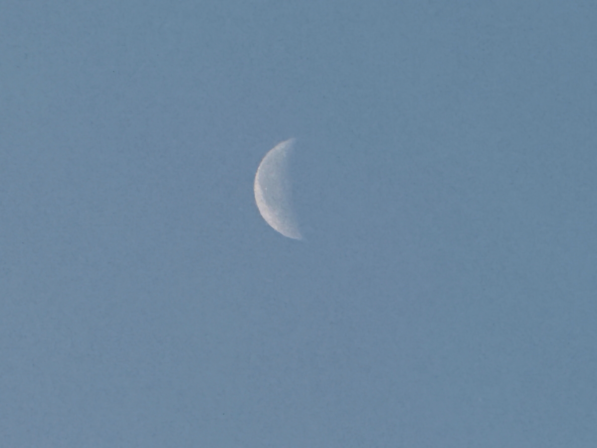

# 20250222_chiangrai

<html>
<head>

<meta charset="UTF-8">
<meta http-equiv="Content-Type" content="text/html; charset=UTF-8">
<meta http-equiv="X-UA-Compatible" content="IE=EmulateIE10" />
<meta http-equiv="X-UA-Compatible" content="IE=edge">

<meta name="viewport" content="width=device-width, initial-scale=1.0">

<!--ここから上はお決まりの定型文です-->

<!--ここからが表現の書式などを決めるcssという部分-->

<link href="https://cdnjs.cloudflare.com/ajax/libs/lightbox2/2.7.1/css/lightbox.css" rel="stylesheet">

</head>

<body>

モバイル端末をお使いの場合は、画面を横向きにすると
より見やすくご覧頂けます。

<!--ここ上は、ほぼそのまま使います！-->

<!--QRコードの挿入例-->

 アクセス用QRコード

<marquee direction="left" scrollamount="20" width="30%">(^_^)/~alis</marquee>

<!--流れ文字の挿入例-->
<h1><marquee behavior="left">!!! 2025/02/22、ほとんどで歩かずにメタバースと無線で過ごす一日!!!</marquee></h1>

                          

<!--ここから下が、本体部分-->

<h2>お日様が顔を出していますが、綺麗な朝焼けでした 朝7:09</h2>

    
<h2>お月様は細くなり始めて見つけにくくなってきました</h2>

    
<h2>月齢は 23.7</h2>

    
<h2>二家族のニワトリ、エサをあげるとひなの大きい方が独占しちゃいます</h2>

    
<h2>扇風機の首がまたガクガク、ネジを締めなおします 完全に設計ミスですね〜</h2>

    
<h2>小さいヒナも食べられるように、エサを二箇所にばら蒔きました</h2>

    
<h2>ランのお花はいつ見ても綺麗です</h2>

    
<h2>メタバース空間のイベントに参加してます 奥のPCでは日本のアマチュア無線通信を聴取中</h2>

    
<h2>大きいヒナがいなくなった隙に、小さいヒナ達にご飯のおかわり</h2>

    
<h2>先日完成した電波を出さないアマチュア無線システムで、日本の無線局と交信 お相手は横浜の局長さんで雪とのことでした</h2>

    
<h2>こちらの画面では仮想空間の温泉でゆったりと世間話</h2>

    
<h2>西の空に薄雲が掛かって、すっきりしない空</h2>

    
<h2>晩御飯は手作りのタイ料理で健康的です</h2>

    
<h2>夕焼け空は期待以上に綺麗でした</h2>

    
<h2>妻がバンコクからチェンライまで飛行機で移動</h2>

    
<h2>18:20のTakeOffで上空から見えた夕暮れ</h2>

    
<h2>チェンライの夜景</h2>

    
<h2>着陸後の混雑具合</h2>

  
<h2>今日のBGMは 再掲ですが「裸の心」by あいみょん</h2>
<iframe width="560" height="315" src="https://www.youtube.com/embed/Pzqpux-TGS8?si=dB1k5FgWSHeLzbv3" title="YouTube video player" frameborder="0" allow="accelerometer; autoplay; clipboard-write; encrypted-media; gyroscope; picture-in-picture; web-share" referrerpolicy="strict-origin-when-cross-origin" allowfullscreen></iframe> 

<h2>再掲の理由ですが、「雪の中で輝くシンデレラ」 by まいてゃとの比較のためです。 歌詞の内容は全く別なのですが、どちらも女の子の心の中身を見事に歌い上げています。 男子はこんなこと考えてないですよね〜</h2>

    
  
<h2>こちらも再掲、メタバース「cluster」内のクリエータ「まいてゃ」さん「雪の中で輝くシンデレラ」</h2>
    
        <h2>メタバース動画(一部のみ)の再生 右側の黒衣装がまいてゃさん、青ドレスはダンサーの玖遠さん</h2>
    <video controls width="640">
        <source src="https://torokoid.github.io/20250219_chiangrai/snow.mp4" type="video/mp4">
        お使いのブラウザは video タグをサポートしていません。
    </video>

<!--
    <h2>MP4ファイルのダウンロード</h2>
    <a href="画面収録 2025-02-16 20.46.41.mp4" download>動画をダウンロード</a>
-->
    
    
    
    
        <h2>フルコーラス再生「雪の中で輝くシンデレラ」by まいてゃ</h2>
<h2><a href="https://torokoid.github.io/20250219_chiangrai/maitiyaz.mp3" target="_blank">この文字クリックで再生します 下の再生ボタンでも同じ曲流します</a></h2>

    <audio controls>
        <source src="https://torokoid.github.io/20250219_chiangrai/maitiyaz.mp3" type="audio/mpeg">
        お使いのブラウザは audio タグをサポートしていません。
    </audio>
    

   
<h2>以上、メタバースと無線で過ごした一日、最後はオレンジの夕焼けでした。 ここまでご覧いただきありがとうございました。</h2>

     
<h2>
<a href="https://torokoid.github.io/20241126_chiangrai/" target="_blank">Back to the menu page</a>
</h2>

   

         

  

      

<!--本体はここまで-->

<!--画面に空白地帯を作って、背景が見えるようにしています-->
                                              

<!-- フッタ -->
<footer>

Copyright 2025/02/23 alis @ChiangRai

</footer>

<!--HPにさまざまなJavaScriptを呼び込むための書式-->

    
    </body>
    
</html>
